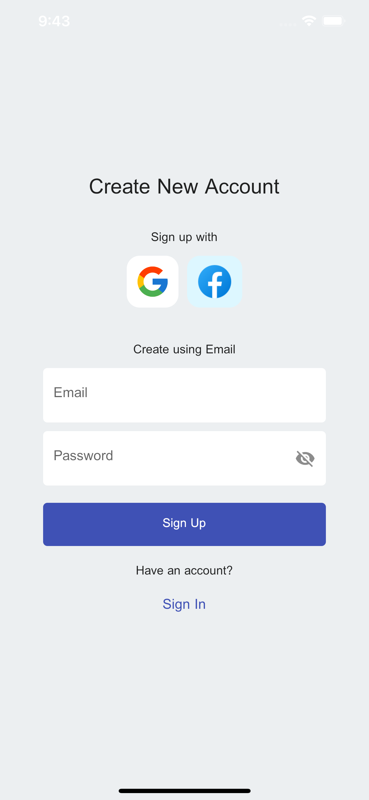
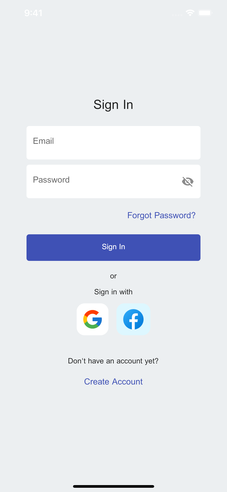
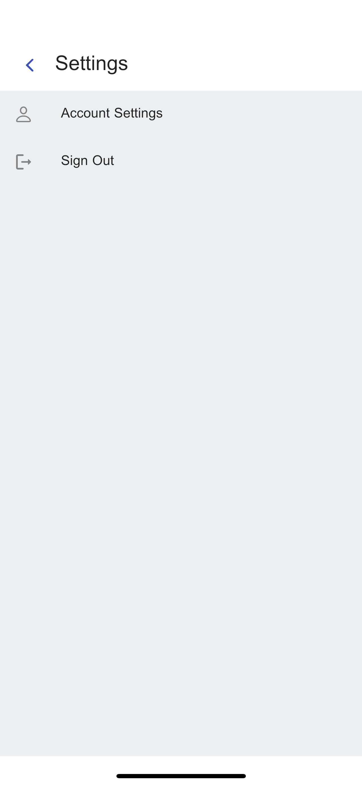
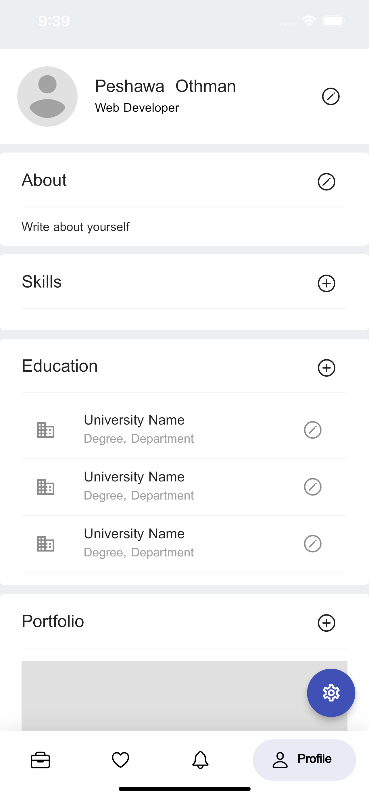
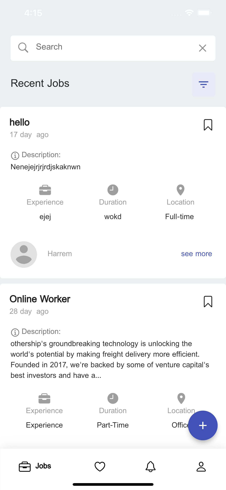
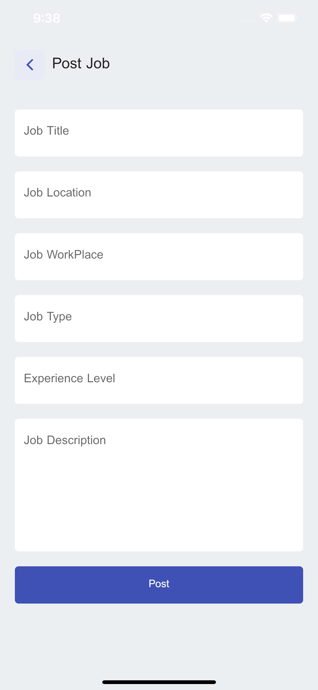

# kurdwork

Job vacancy application for both Android&iOS.

## Getting Started

This project is made and will be maintained with Flutter.

## Project Core Features

- User Authentication with Firebase Authentication (Done)
- Sign in with Google (Done)
- Sign in with Facebook (Pending)
- Posting job to Firebase Database (Done)
- Apply for jobs (Pending)
- Profile Management (in-progress)
- State Management with Bloc Design Pattern (Done)
- Route Management (In-Progress)
- Localization (Pending)
more features will be added in the future

## Screenshots

## Dependencies

- firebase_core: ^1.20.0
- firebase_auth: ^3.5.0
- google_sign_in: ^5.4.0
- cloud_firestore: ^3.4.0
- firebase_storage: ^10.3.7
- cupertino_icons: ^1.0.2
- google_nav_bar: ^5.0.6
- email_validator: ^2.1.2
- flutter_holo_date_picker: ^1.0.6
- flutter_bloc: any
- file_picker: ^5.0.1
- flutter_image_compress: ^1.1.2
- equatable: ^2.0.5

A few resources to get you started if this is your first Flutter project:

- [Lab: Write your first Flutter app](https://docs.flutter.dev/get-started/codelab)
- [Cookbook: Useful Flutter samples](https://docs.flutter.dev/cookbook)

For help getting started with Flutter development, view the
[online documentation](https://docs.flutter.dev/), which offers tutorials,
samples, guidance on mobile development, and a full API reference.